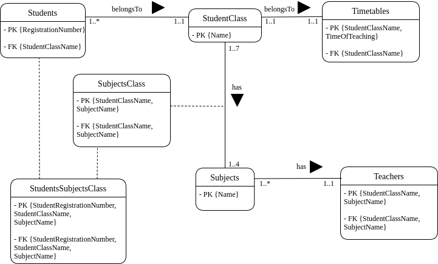

# AOOP_assignment

This assignment involves the use of Java with Swing and JDBC for database connectivity.

## Background

This repository is aimed at the development of a Java Windows application which will solve issues faced by Teachers and Students of Katikamu Primary School.

## Versions Used

### Java Version

Java-16 was used to develop this application. It is recommended that it is run using the same Java version since it is found of running into issues with earlier versions.

### MySQL Version

MySQL 5.8 was used to develop this application. No issues should arise in the case of another version being used.

## About

### Assignment Details

This assignment is meant to have us develop a Java Windows Application to solve issues of Teachers and Students in Katikamu Primary School as highlighted in the assignment.

Teachers' issues will be solved by enabling them to;
1. Log into the application.
2. Register students.
3. Record students' marks.
4. See all registered students.
5. Search a student using their registration number.
6. Filter students using a subject name.

Students' issues will be solved by enabling them to;
1. Log into the application.
2. See their marks.
3. See their class timetable.

### File Structure

There are five packages in the project's source folder namely:-
1. DatabaseManager
	This contains files needed to set up the database

2. Models
	This contains files describing the different entities used in our application

3. Services
	This contains the interfaces states the different methods that can be carried out by and on our entities in the application

4. ServicesImplementation
	This contains files that have the definitions for the different methods that can be carried out by and on our entities in the application

5. StudentGui
	This package contains all the frontend components and layout for the student side of the application

6. TeacherGui
	This package contains all the frontend components and layout for the teacher side of the application

### Models Involved

The major models involved that result into database tables include;
1. Students.
2. StudentClass.
3. Timetables.
4. Subjects.
5. Teachers.

Some of the relationships between the above models are derived into associative tables that include;
1. SubjectsClass. It stands in for the many to many relationship between the StudentClass and Subjects model.
2. StudentsSubjectsClass. It stores marks that are attached to a specific Student, StudentClass and Subject.

### Database Design

The Database Design below describes the relationships of the above models:

## How to Run it

Proceed to the rms_Application package and run the MainFrame.java file.

### (A) Setting up the Database

#### 1 . Your credentials

Proceed to the 'DatabaseManager' package. Edit the two methods in the DatabaseConnection file with your mysql credentials.

#### 2. Creating the database and tables

Run the 'CreateDatabaseAndTables' file. The database structure and data for the successful running of the application will be created for you.

## Issues/Concerns
One is not yet able to filter records
There are some validations missing.
One is only able to receive error messages through the console

## Conclusion

All work in this repository was entirely a group effort and each member of the group was able to commit what they had worked on either individually or as a group. Commits might seem inconsistent, but this is only because physical meet ups were scheduled for most of the development. These meet ups involved [pair programming](https://en.wikipedia.org/wiki/Pair_programming) from which the end result was mostly code on one individual's computer. However, it was ensured that every member was fully involved and understood how the development came along. 
